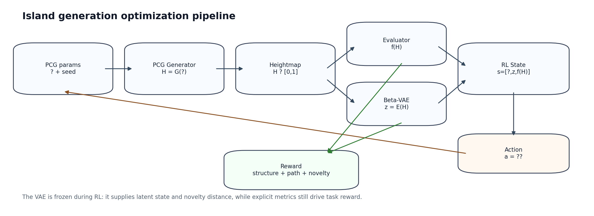
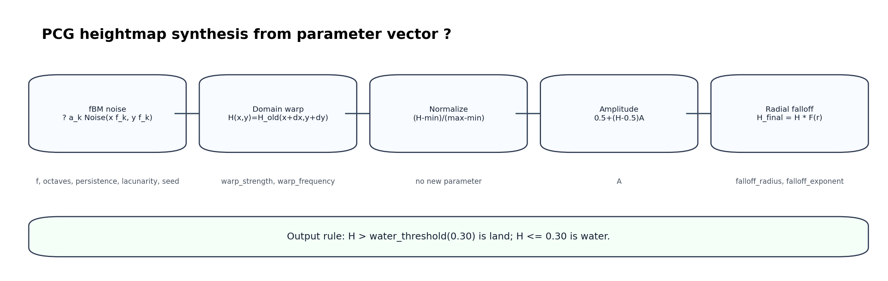
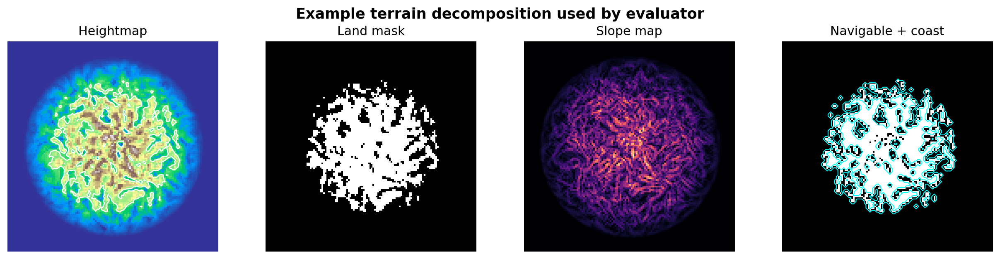
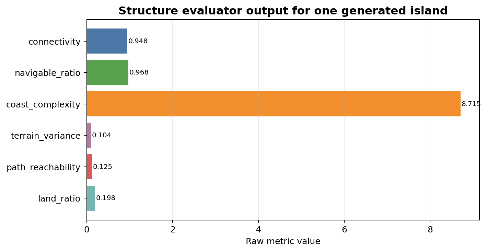
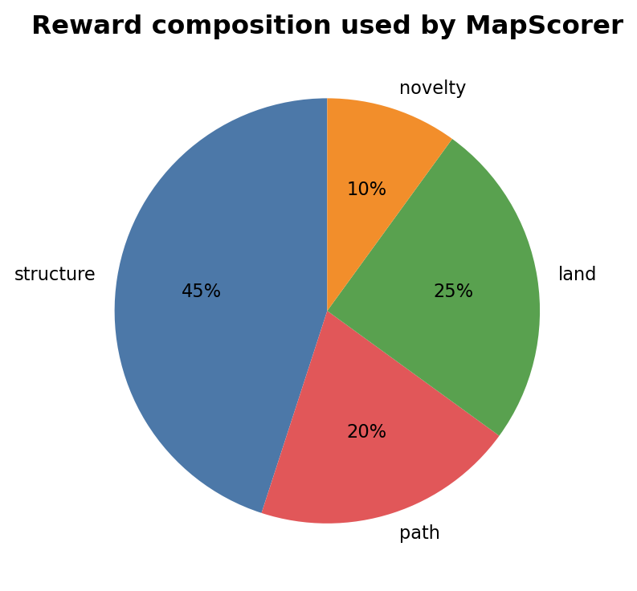
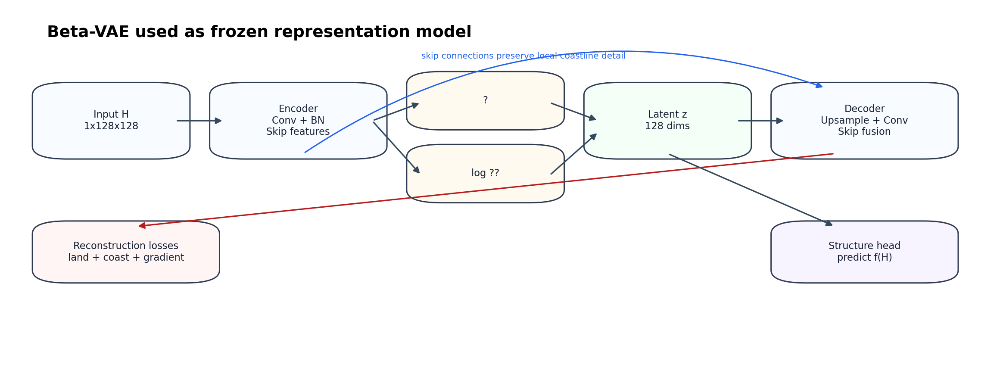
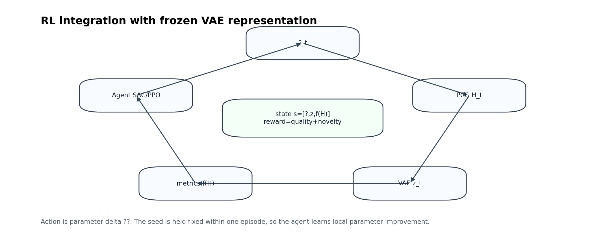

# IslandTest 项目流程图文说明

本文档用于解释当前 IslandTest 项目的完整技术链路。它按论文/汇报风格组织，覆盖参数含义、PCG 生成、高度图评价、VAE 表征、强化学习接入、奖励函数和正式实验流程。

## 1. 当前项目总览

当前项目的核心目标是：用参数化 PCG 生成岛屿高度图，再用结构评价器和 VAE 表征作为强化学习状态，让智能体学习如何调节生成参数，使地图在结构、可导航性、路径可达性和多样性上更好。



主流程可以写成：

```text
theta -> PCG Generator -> heightmap H
H -> Structure Evaluator -> f(H)
H -> Beta-VAE Encoder -> z
[theta, z, f(H)] -> RL Agent -> action delta theta
delta theta -> update theta -> next map
```

当前代码里，RL 状态已经对齐为：

```text
s = [theta_norm, z_norm, metrics_norm]
```

动作是连续参数增量：

```text
a = delta theta_norm
```

VAE 在 RL 中保持冻结，只负责提供稳定 latent 表征和 novelty 距离，不参与 RL 联训。

## 2. PCG 参数体系

项目中的地形参数可以分成四组。

| 参数 | 含义 | 主要影响 |
|---|---|---|
| `f` | 基础频率 | 控制基础地形纹理疏密 |
| `A` | 振幅缩放 | 控制高低起伏强弱 |
| `N_octaves` | fBM 噪声层数 | 控制细节层数 |
| `persistence` | 振幅递减系数 | 控制高频细节保留程度 |
| `lacunarity` | 频率增长系数 | 控制每层噪声频率增长速度 |
| `warp_strength` | 坐标扭曲强度 | 控制海岸线和地形扭曲幅度 |
| `warp_frequency` | 坐标扭曲频率 | 控制扭曲场细碎程度 |
| `falloff_radius` | 径向衰减半径 | 控制岛屿主体大小 |
| `falloff_exponent` | 径向衰减指数 | 控制边缘衰减陡峭程度 |
| `seed` | 随机种子 | 控制同一参数下的随机实例 |

严格说，前 9 个是生成控制参数，`seed` 是随机实例控制。

参数范围由 [pcg_generator.py](../pcg_generator.py) 中的 `get_param_ranges()` 和 `get_sampling_ranges()` 定义。正式采样默认使用 `island` profile，它比完全均匀采样更偏向有效单岛。

## 3. PCG 生成过程

PCG 生成器的目标是从参数向量 `theta` 生成高度图：

```text
H = G(theta)
```

当前实现流程如下。



### 3.1 fBM 噪声

对每个像素 `(x, y)` 计算多层噪声叠加：

```text
H_fbm(x,y) = sum_k a_k * Noise(x / map_size * f_k, y / map_size * f_k)
```

其中：

```text
f_0 = f
a_0 = 1
f_{k+1} = f_k * lacunarity
a_{k+1} = a_k * persistence
```

这一阶段生成基础地形纹理。

### 3.2 Domain Warping

坐标扭曲不是直接改高度值，而是改变采样位置：

```text
H_warp(x,y) = H_old(x + dx(x,y), y + dy(x,y))
```

其中 `dx`、`dy` 由另一组噪声产生，受 `warp_strength` 和 `warp_frequency` 控制。

作用是让海岸和山体不那么规则，避免机械圆岛。

### 3.3 Normalize

把整张图缩放到 `[0, 1]`：

```text
H_norm = (H - min(H)) / (max(H) - min(H) + epsilon)
```

### 3.4 Amplitude Scaling

围绕 `0.5` 放大或缩小高度差：

```text
H_amp = clip(0.5 + (H_norm - 0.5) * A, 0, 1)
```

`A > 1` 时，高处更高、低处更低；`A < 1` 时，地形更平缓。

### 3.5 Radial Falloff

径向衰减负责把普通噪声地形压成岛：

```text
d(x,y) = sqrt((x - cx)^2 + (y - cy)^2)
r(x,y) = d(x,y) / falloff_radius
F(x,y) = 1 - min(1, r(x,y) ^ falloff_exponent)
H_final(x,y) = H_amp(x,y) * F(x,y)
```

最终海陆划分规则是：

```text
H > 0.30  -> land
H <= 0.30 -> water
```

## 4. 结构评价器

高度图生成后，`StructureEvaluator` 会计算结构指标。



当前核心指标是：

| 指标 | 公式/定义 | 用途 |
|---|---|---|
| `connectivity` | 最大陆地连通块面积 / 总陆地面积 | 判断是否接近单岛 |
| `navigable_ratio` | 可通行陆地面积 / 总陆地面积 | 判断陆地区域是否适合行走 |
| `coast_complexity` | perimeter / 同面积圆形周长 | 描述海岸曲折程度 |
| `terrain_variance` | 陆地区域高度标准差 | 描述地形起伏 |
| `path_reachability` | A* 路径成功率 | 验证可通行区域是否真的走得通 |
| `land_ratio` | 陆地面积 / 全图面积 | 辅助约束岛屿大小 |



注意：`land_ratio` 不是任务书里的核心结构指标，它现在作为工程辅助约束保留，用来避免地图退化为几乎全海或几乎全陆。

### 4.1 连通性

先得到陆地掩码：

```text
land_mask = H > water_threshold
```

再用连通域标记得到所有陆地块，取最大陆地块面积：

```text
connectivity = largest_component_area / total_land_area
```

### 4.2 导航性

先计算带尺度的坡度：

```text
elevation = H * height_scale
slope = atan(sqrt((dH/dx)^2 + (dH/dy)^2))
```

再定义可通行区域：

```text
navigable_mask = land_mask and slope < slope_threshold
```

最后计算：

```text
navigable_ratio = sum(navigable_mask) / sum(land_mask)
```

### 4.3 路径可达性

当前项目已经把旧的单源 BFS 改成轻量 A* 路径验证：

```text
1. 在 navigable_mask 中选代表点
2. 构造若干 start-goal pairs
3. 对每对点运行 A*
4. path_reachability = success_pairs / tested_pairs
```

A* 移动代价包含坡度惩罚：

```text
step_cost = 1 + slope_cost_weight * normalized_slope
```

这比单纯连通性更接近真实路径可达要求。

## 5. 奖励函数

奖励由 `MapScorer` 统一计算。



总奖励：

```text
R = 0.45 * R_structure
  + 0.20 * R_path
  + 0.25 * R_land
  + 0.10 * R_novelty
```

结构奖励：

```text
R_structure =
  0.30 * connectivity_score
+ 0.25 * navigable_score
+ 0.20 * coast_score
+ 0.25 * variance_score
```

其中 `navigable_score`、`coast_score`、`variance_score` 都采用区间型软评分。落入理想区间得高分，偏离区间逐渐降分。

路径奖励：

```text
R_path = path_reachability
```

新颖性奖励使用 VAE latent：

```text
R_novelty = min_distance(z_t, historical_z_buffer)
```

并经过尺度归一化后裁剪到 `[0, 1]`。

## 6. Beta-VAE 表征模型

当前 VAE 不是普通图片 VAE，而是面向高度图和岛屿结构定制过的 Beta-VAE。



### 6.1 输入输出

输入：

```text
H: 1 x map_size x map_size
```

输出：

```text
H_recon: reconstructed heightmap
mu, logvar: latent Gaussian parameters
z: latent vector
```

训练时：

```text
z = mu + sigma * epsilon
```

推理和 RL 接入时：

```text
z = mu
```

这样可以保证 RL 看到的状态是稳定的。

### 6.2 结构设计

当前 VAE 包含：

```text
Encoder: Conv -> BatchNorm -> ReLU -> skip features
Latent: mu / logvar
Decoder: interpolation upsample + convolution + residual refine
Skip fusion: preserve local coastline details
Structure head: predict core metrics from latent
```

`structure_head` 只预测核心结构指标：

```text
connectivity
navigable_ratio
coast_complexity
terrain_variance
path_reachability
```

不把 `land_ratio` 当作核心结构监督目标。

### 6.3 损失函数

VAE 的训练目标不只是像素重建，还包括地形结构保真：

```text
Loss =
  reconstruction_loss
+ beta * KL
+ structure_loss_weight * structure_loss
```

重建损失内部包含：

```text
MSE
L1
land-weighted MSE/L1
coast-weighted MSE/L1
gradient loss
land mask loss
coast response loss
land Dice loss
coast Dice loss
```

这套设计的目标是避免早期出现的“平均圆岛”重建问题。

## 7. RL 接入方式

当前正式 RL 流程已经在 `formal_experiment.py --formal-rl` 中接好。



### 7.1 状态

状态由三部分组成：

```text
s = [theta_norm, z_norm, metrics_norm]
```

其中：

| 状态部分 | 来源 | 作用 |
|---|---|---|
| `theta_norm` | PCG 参数归一化 | 告诉 agent 当前参数位置 |
| `z_norm` | 冻结 VAE 编码 | 提供地图整体形态语义 |
| `metrics_norm` | 结构评价器 | 提供显式任务指标 |

### 7.2 动作

动作是参数增量：

```text
a = delta theta_norm
theta' = clip(theta + step_scale * a, -1, 1)
```

每个 episode 内 `seed` 固定，这样 agent 主要学习在同一随机实例上如何局部调参。

### 7.3 策略

项目当前支持：

```text
Zero baseline
Random baseline
PPO
SAC
```

其中 SAC 更符合连续动作空间的主算法设定；PPO 保留为对照。

## 8. 数据集与实验流程

正式流程分为：

```text
1. 生成原始 PCG 样本
2. 清洗样本
3. 构造 heightmaps / metric_matrix / core_metric_matrix
4. 训练 VAE
5. train / val / test 测评 VAE
6. 拟合 feature_normalizer
7. 冻结 VAE 后训练 RL
8. 对 Zero / Random / PPO / SAC 进行最终评估
```

正式 VAE-only 测评入口：

```bash
python formal_experiment.py --formal-vae-only --output-dir formal_vae_eval
```

正式 RL 测评入口：

```bash
python formal_experiment.py --formal-rl --output-dir formal_rl_eval
```

快速 64x64 测试入口：

```bash
python formal_experiment.py --formal-rl --fast-profile --map-size 64 --output-dir formal_rl_fast64
```

## 9. 当前项目审查结论

### 已经比较稳的部分

1. PCG 参数链路清晰，能从 `theta` 稳定生成高度图。
2. 评价器已经包含连通性、导航性、海岸复杂度、地形起伏和 A* 路径可达性。
3. VAE 当前重建能力已经明显改善，支持 skip connection、海岸损失和结构监督。
4. RL 状态已经包含 `theta + z + f(H)`，符合当前任务定义。
5. `--formal-vae-only` 和 `--formal-rl` 已经能跑完整流程。
6. `--fast-profile` 可以让 Colab 先用 `64x64` 快速验证。

### 需要继续注意的部分

1. `land_ratio` 是辅助工程约束，写论文时不要把它混成任务书核心指标。
2. VAE latent 对海岸复杂度、导航性、地形方差更强，对连通性和路径可达性这种拓扑性质通常较弱，因此 RL 中必须保留显式 metrics。
3. SAC 应作为连续动作空间主实验，PPO 更适合作为对照。
4. 根目录仍有一些历史 notebook 和旧报告，建议最终交付前再统一整理成 `docs/` 和 `experiments/` 两类。

## 10. 当前推荐汇报图顺序

建议论文或答辩中按以下顺序放图：

1. `pipeline_overview.png`: 总体方法框架
2. `pcg_process.png`: PCG 参数生成过程
3. `terrain_decomposition.png`: 高度图到结构掩码的分解示例
4. `metric_example.png`: 评价器输出示例
5. `vae_architecture.png`: VAE 结构
6. `rl_loop.png`: RL 状态、动作、奖励闭环
7. `reward_composition.png`: 奖励函数组成

